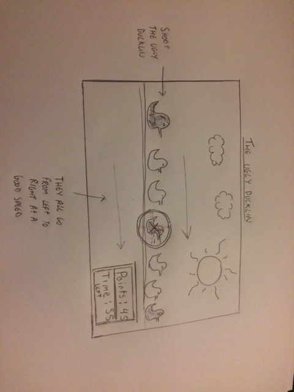
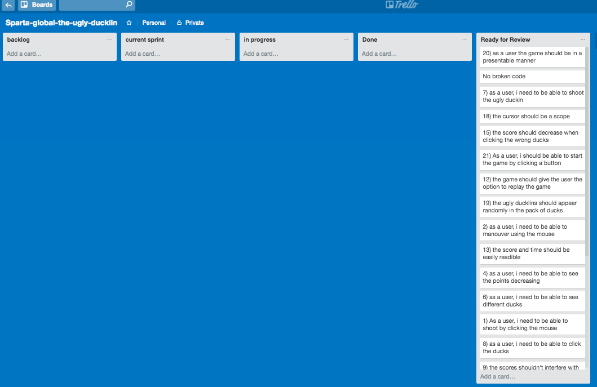

# The Sparta Project

## Purpose

Your mission, should you choose to accept it! Is to build a **browser based game!**
Your game should be built using html, css and JavaScript!

## Deliverables

* Include an instruction section explaining how to play the game.
* Ether display a message when the user has won or display the users score after the game has finished.
* Be styled to perfection!
* Be hosted online!

## Task

Your mission, should you choose to accept it! Is to build a **browser based game!** Your game should be built using html, css and JavaScript!

**The choice of game is totally up to you however before you get to work, you must ensure you have had your project idea approved by one of your trainers.**

# The Game
The game is called 'The Ugly Duckling'.

#Introduction/Instructions
The game itself is very simple, The point is to try and score as many points as possible in 30 seconds by clicking the mouse, The yellow ducks are worth 1 point while the Ugly Ducks decrease your score by 2 points.

# Wireframe

# Trello

## What Went Well
i believe i have learnt a vast amount in this week, the project from start to finish has enabled me to understand the fundamentals of JavaScript,
i.e how to wrap functions in other functions, where to put code and why code doesn't work in other places. Its given me a better understanding of HTML, CSS, JQUERY & JavaScript and how to implement them together.

The game itself is well presented, i took a lot of time into the presentation. i think i chose the right colours to make it look appealing for the client.

## What went Wrong
there were little Hiccups which came on the way, such as elements not being targeted, however after analysing it for a hour it was all due to a little syntax error. One bigger hiccup was that when the ducks are being created, there was an error where only the first duck was being counted in the points and the rest of the ducks were not being counted in the scores once clicking them. After a long time i had found out that as the ducks were being created every second, the code for the score was only counting the first duck due to the second duck being created after the score code was already run, to counter this, this specific score code was then put in the same function as the creating ducks code, which when looped will still run the score code.

Also i would have liked to implement a second player scenario,but time was permitting this and when i tried to do the coding for it, it messed up the game and the game didn't work, i then reverted back to the old code to ensure there was still a working product to deliver.

## What could be Improved
the game would have been better with a second player scenario, but i felt that if i had another day i could have implemented this. Also I think with extra sounds like ducks quacking and a gun shot sound would have improved the game a lot.
